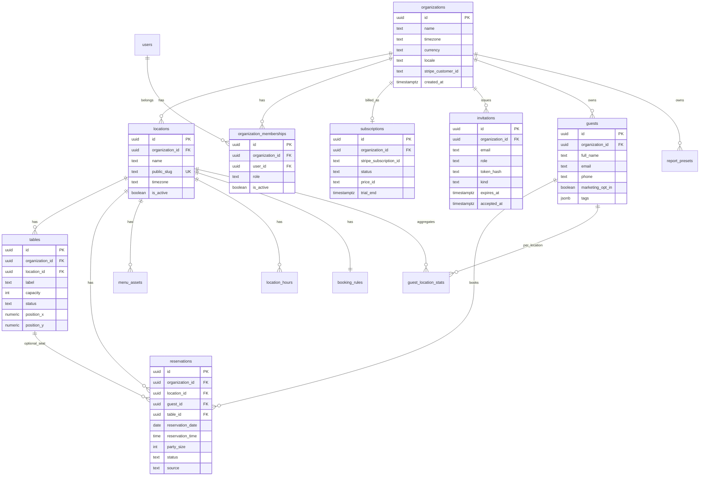

# DATA_MODEL.md — MVP target schema

**Status:** Target for Phase 0–1 migrations (do not edit applied migrations; add new ones only).  
**Defaults:** currency `CAD`, timezone `America/Toronto`, locale `en-CA` (fr-CA keys ready).

---

## ADR-001 — Isolation model (DECIDED)

**Decision:** Single shared Postgres with **logical isolation** via `organization_id` (+ `location_id` where relevant) and **Row Level Security**. Every tenant table is org-scoped. No dedicated DB per restaurant in v1.

**Reasoning:**
- Cost — one project, one migration path, one backup/PITR story.
- Ops — platform admin can support tenants without N databases.
- Product — multi-location and multi-org memberships (e.g. DHG across brands) fit naturally.
- Future — a dedicated-instance enterprise tier can be forked later because **all app queries are already org-scoped**; only connection string + project split change.

**Rejected for v1:** schema-per-tenant, database-per-tenant.

**Enforcement:** Isolation is tested automatically (two orgs; assert invisibility of every table, RPC, storage path, realtime channel). Tests gate every PR.

---

## Entity overview

```
organizations
  ├── subscriptions (Stripe mirror)
  ├── organization_memberships (users ↔ orgs + role)
  ├── invitations
  ├── guests (CRM, org-level)
  └── locations
        ├── tables
        ├── reservations
        ├── booking_rules / hours
        ├── menu_assets
        └── report_presets
```

Active org/location comes from **memberships** (plus optional `user_active_context` hint), verified by RLS — **never** from localStorage as source of truth.

---

## ERD (Mermaid)



---

## Tables (MVP)

### Platform / auth context

| Table | Purpose | Key columns |
|-------|---------|-------------|
| `users` | Profile mapped to `auth.users` | `id` (= auth uid), `email`, `full_name` |
| `user_active_context` | Last selected org/location (**hint only**) | `user_id`, `organization_id`, `location_id` — RLS still checks membership |
| `platform_admins` | Internal ops | `user_id` |
| `platform_settings` | Global flags | `signup_mode` (`invite_only` \| `open`) |

### Tenant core

| Table | `organization_id` | `location_id` | Notes |
|-------|-------------------|---------------|-------|
| `organizations` | PK | — | Branding defaults, Stripe customer, timezone/currency/locale |
| `locations` | NOT NULL FK idx | PK | Globally unique `public_slug` for `/book/{slug}` |
| `organization_memberships` | NOT NULL idx | — | Roles: `owner` \| `manager` \| `host` |
| `location_memberships` | NOT NULL | NOT NULL | Optional scope for hosts |
| `subscriptions` | NOT NULL UK | — | Stripe mirror; webhook-updated |
| `invitations` | NOT NULL | nullable | `kind`: `owner_onboarding` \| `team`; store **token_hash** only; expiry; single-use |
| `guests` | NOT NULL idx | — | Org-level CRM |
| `guest_location_stats` | NOT NULL | NOT NULL | visits, last_visit, no_shows, cancellations |
| `guest_notes` | NOT NULL | nullable | Append-only notes with author |
| `reservations` | NOT NULL | NOT NULL | Replaces `v2_bookings` |
| `tables` | NOT NULL | NOT NULL | Floor plan |
| `location_hours` | NOT NULL | NOT NULL | Per weekday open/close / closed |
| `booking_rules` | NOT NULL | NOT NULL | Slot length, max party, lead time, buffers |
| `menu_assets` | NOT NULL | NOT NULL | PDF/image storage paths |
| `report_presets` | NOT NULL | nullable | Saved report configs |
| `slug_redirects` | NOT NULL | NOT NULL | Old slug → new slug |

**Indexes (minimum):**  
`organization_id`; `(organization_id, location_id)`; reservations `(location_id, reservation_date)`; guests `(organization_id, lower(email))`, `(organization_id, phone)`; invitations `(token_hash)` UNIQUE; locations `public_slug` UNIQUE.

**Slug rules:** reserved words blocked (`app`, `api`, `admin`, `invite`, `billing`, `login`, `book`, `health`, …). Owner may change slug; keep `slug_redirects`.

### Stripe mirror (`subscriptions`)

| Column | Notes |
|--------|-------|
| `stripe_customer_id` / `stripe_subscription_id` | Also denormalize customer on org |
| `status` | `trialing` \| `active` \| `past_due` \| `canceled` \| `incomplete` \| … |
| `price_id` | Stripe Price |
| `trial_end`, `current_period_end` | |

**App gate:** allow only `trialing` \| `active`; else redirect `/billing/locked`.

### Reservations

| Column | Notes |
|--------|-------|
| `status` | `pending` \| `confirmed` \| `seated` \| `completed` \| `cancelled` \| `no_show` |
| `source` | `public` \| `manual` \| `walk_in` |
| `party_size` | int > 0 |
| `table_id` | nullable until assigned/seated |
| `guest_id` | NOT NULL after create |
| Denormalized guest name/phone/email | List performance |

### Guests (CASL / Loi 25)

| Column | Notes |
|--------|-------|
| `marketing_opt_in` | default false |
| `marketing_opt_in_at` / `marketing_opt_out_at` | |
| `marketing_opt_in_source` | text |
| `tags` | text[] |
| `notes` | summary; detail in `guest_notes` |

---

## Roles (application + RLS)

| Role | Capabilities |
|------|----------------|
| `owner` | Full org including billing, team, all locations |
| `manager` | Non-billing settings, CRM, reports, host stand, bookings |
| `host` | Host stand + bookings + guest notes for assigned locations; no billing/team admin |

Platform admin: SECURITY DEFINER RPCs only.

---

## RLS policy summary

For every tenant table `T`:

1. Authenticated access only if `organization_id` ∈ user's active memberships.
2. Role helpers: `app_has_org_role(org_id, roles text[])`, `app_can_access_location(location_id)`.
3. **Anon: zero direct table grants.** Public booking via SECURITY DEFINER RPCs only.
4. Storage private by default; path `org/{organization_id}/...`; signed URLs for public menu.

---

## RPCs (MVP)

| Name | Security definer? | Rate limit | Purpose |
|------|-------------------|------------|---------|
| `app_accept_invite(token)` | yes | per-IP + token | Accept invite → membership |
| `app_complete_onboarding(...)` | yes | per-user | Org + first location after paid |
| `app_set_active_context(org, loc)` | yes | — | Hint row after membership check |
| `public_get_location_by_slug(slug)` | yes | per-IP | Safe public bootstrap |
| `public_get_availability(slug, date)` | yes | per-IP | Slots |
| `public_create_reservation(...)` | yes | per-IP + phone | Create + guest upsert |
| `public_get_menu_assets(slug)` | yes | per-IP | Menu assets |
| `staff_seat_reservation(...)` | yes | — | Host stand |
| `staff_unseat_reservation(...)` | yes | — | Clear table |
| `staff_create_walk_in(...)` | yes | — | Walk-in |
| `reports_reservation_metrics(...)` | yes | — | Dashboard/reports aggregates |

**Edge Functions:** `stripe-webhook` (idempotent, signature-verified), `stripe-checkout` / portal, `invite-create`. Stripe keys **only** in Edge secrets.

---

## Migration from current `v2_*`

| Current | Target action |
|---------|---------------|
| `v2_restaurants` | Backfill → `organizations` + `locations` (1:1) |
| `v2_users` | → `users` + `organization_memberships` |
| `v2_customers` | → `guests` |
| `v2_bookings` | → `reservations` |
| `v2_tables` | → `tables` (+ org_id) |
| `v2_orders*`, `v2_menu_*`, `v2_loyalty*`, `v2_shifts`, `v2_waitlist` | **Drop** after code removal |
| `v2_platform_settings` | Keep; add `signup_mode` |
| Plan on restaurant | → `subscriptions` + Stripe |

Never edit applied migrations; additive + backfill + cutover migrations only.

---

## Out of schema (do not add in MVP)

Orders, inventory, loyalty, payroll, marketing campaigns, SMS waitlist, AI, guest deposits/payments.
